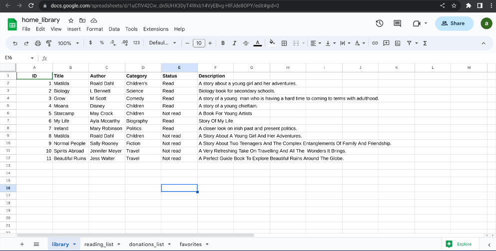
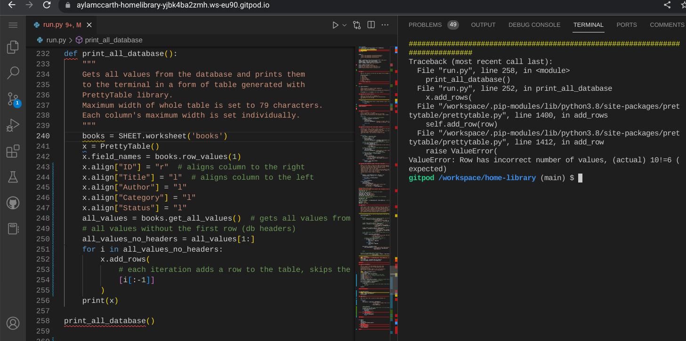

<h1 align = "center">Home Library App- Python Project </h1>

<b>[View live program here](https://pp3-home-library.herokuapp.com/) </b>  

The Home Library App was created as Portfolio Project #3 (Python Essentials) for Diploma in Full Stack Software Development at [Code Institute](https://www.codeinstitute.net). The main goal of the application is to allow users to manage their personal/family book libraries. The app has the following features: view, add, update, search and remove books from the database.

Project purpose was to build a command-line python application that allows user to manage a common dataset about a particular domain.

# Table of Content

*   [Project](#project)
    *   [Strategy/Scope](#strategyscope)
    *   [Site owner goals](#site-owner-goals)
    *   [External user's goal](#external-users-goal)
*   [User Experience (UX/UI)](#user-experience-ux)
*   [Logic and features](#logic-and-features)
    *   [Python logic](#python-logic)
    *   [Database structure](#database-structure)
    *   [Features](#features)
        *   [Main menu](#main-menu)
        *   [Add book](#add-book)
        *   [Update book](#edit-book)
        *   [Remove book](#remove-book)
        *   [View all books](#view-all-books)
        *   [Search book](#search-book)
        *   [Show book details](#show-book-details)
        *   [Exit](#exit)
*   [Technology](#technology)
    *   [Software used](#software-used)
    *   [Python libraries/modules](#python-librariesmodules)
*   [Testing](#testing)
    *   [Validation](#validation)
    *   [Manual testing](#manual-testing)
    *   [Bugs/known issues](#bugsknown-issues)
*   [Deployment](#deployment)
    *   [Git and GitHub](#git-and-github)
    *   [Deployment to Heroku](#deployment-to-heroku)
*   [Possible future development](#possible-future-development)
*   [Credits](#credits)
    

# Project
## Strategy/Scope

I would like to build an application that can be used in real life, to help with repetitive but necessary daily tasks. 
This idea came to mind when I was brainstorming on what app to develop to help my life as a parent taking care of a young family. Initially I thought about a weekly grocery shopping list app, but when I saw our books all over the house, that's when I decided, an app to manage and keep track of these books would be perfect! Home Library App was designed to allows users to manage their personal/family book libraries. The application offers functionalities such as: viewing book database, adding, updating, searching and removing books.

The application should have a clean and intuitive user interface and offer easy access and navigation to all functionalities.

To achieve the strategy goals, I implemented the following features:

- Customised terminal display page for better visual experience.
- Colours in terminal to give user feedback dependent on his actions.
- Reliable and quick connection with database provided by Google.
- Menu with easy access to all features and possibility to exit or restart the application.
- Clean user interface for easy navigation and readability.

## Site owner goals

As a program owner/developer I would like to:
- create application that has real life usage,
- create application that is easy to use and intuitive to navigate,
- provide user a feedback to every input and action,
- decide what kind of user input is allowed by implementing validations,
- try my best to build a bug free application.

##  External user's goal

As a user I would like to:
- be able to clearly understand application's purpose from the first contact,
- be able to use program in real life,
- be able to easily navigate the program and access all features,
- be able to receive feedback to actions taken,
- be able to decide what to do next, what features to use,
- be able to quit program,

# Logic and Features

## Python Logic

A flow diagram of the logic behind the application was created using [Lucid Chart](https://www.lucidchart.com/).

## Database Structure

Google Sheets is used to create the application database. There is only one worksheet named "library" used to store all the data.

The worksheet consists of six colums: ID, title, author, category, status and description. This will form the structure of the prettyTable which will be used to print out datas in a form of a table throughout the different functionalities of the application.

Each column has individually assigned value that represents maximum length of the string that can be input by user. It's 2, 24, 18, 12, 8 and 200 characters respectively. Exceeding that limit results in error and feedback sent to the user. This limitation is necessary to correctly display the table in the terminal which maximum length is 80 characters.  

The ID column value is assigned automatically when new book is added and also all ID values are renumbered when book is removed.

## Features

### Main menu

Start screen of the application consists of ASCII logo, welcome message and 
main menu with 7 options. User input is validated.

### Add book

This feature allows the user to add new book to the library. 
The user will be asked to input details such as title, author, category, description and status.
 All inputs are validated.

Input has to be a minimum 3 characters long.

Each book detail has individually set maximum length. Max. title length is 24 characters.

Input can't be empty.

Title can't start with special character.

When all the user inputs are successfully validated, the user will be asked if he wants to 
proceed adding the book. The same validations will be used throughout the application.

### Update Book

This feature allows user to edit every book's detail. The input is validated. 
There is also a "return" option which will bring the user back to main menu. 
This function works similarly as the add book function. The user will also be 
ask to confirm before proceeding to update. 

### Remove book

This feature allows the user to remove a book from the database. 
Like the two previous features above, user input will be validated. 

User will be asked to confirm before deletion.

Confirmation message is shown once the chosen book is deleted.

### View All Books

This feature allow the user to see the entire library database printed out on a prettyTable.
The main menu is also printed below the table to give user access to the other functionalities.

### Show Book Details

This feature allows the user to view a detailed information of the selected book.

### Search Book

This feature allows the user to search a particular book by inputting 
either book title or author name.
The input is validated.

Upon successful input validation, a confirmation message is printed wether 
the searched book is in the database or not.
The user also has the option to return to main menu.

### Exit

This feature allows the user to exit the application. User input is validated. 
A thank you message is printed if user decides to exit the app or take him back 
to main menu otherwise.

#   Technology
    
##  Languages used

-   [Python](https://www.python.org/) - high-level, general-purpose programming language.
-   [Markdown](https://en.wikipedia.org/wiki/Markdown) - markup language used to write README and TESTING documents.

##  Software used

- [Favicon.io](https://www.favicon.io) - tool used to create favicon.

- [Git](https://git-scm.com/) - Git was used for version control by utilizing the Gitpod terminal to commit to Git and Push to GitHub.

- [GitHub](https://github.com/) - GitHub is used to store the project's code after being pushed from Git.

- [Google Sheets API](https://developers.google.com/sheets/api) - was used to connect with the database made of the spreadsheet.

- [Heroku](https://heroku.com) - online app used to deploy project.

- [LucidChart](https://www.lucidchart.com/pages) - was used to create flow diagram.

- [Text ASCII Art Generator](https://patorjk.com/software/taag/#p=display&f=Standard&t=Home%20Library) - used to create app logo in ASCII format.

##  Python libraries/modules

- [gspread](https://docs.gspread.org/) - used for control Google Sheets API by python.

- [OAuthLib](https://pypi.org/project/oauthlib/) - required to manage HTTP request and authenticate to Google Sheets API.

- [PrettyTable](https://pypi.org/project/prettytable/) - python library for easily displaying tabular data in a visually appealing ASCII table format.

- [colorama](https://pypi.org/project/colorama/) - used to color terminal outputs.

- [os](https://docs.python.org/3/library/os.html) - built-in pythod module - used to write clear_terminal function.

- [textwrap](https://docs.python.org/3/library/textwrap.html) - built-in python module - used to wrap lines over 79 char to next line e.g. long book description.

# Testing

Manual testing was ongoing throughout the building process.

See [TESTING.md](TESTING.md) for an overview of function  and validation testing.

## Validation 

### PEP8

[PEP8CI](https://pep8ci.herokuapp.com/) app was used to lint the code.
There are some warnings for whitespaces and escape character in app logo created in "text to ASCII generator". This doesn't affect any functionalities of the application and code is interpreted as intended, terminal output is displayed as intended.

## Bugs / Unsolved Issues

I encountered so many bugs throughout the building process. Most of them I was able to fix on time but there are still some that are unfortunately I wasn't able to fix.

### Fixed bugs
- Issue : To print data base using prettytable. I found this bug so challenging but eventually managed to solve it.
  it.
  

- Issue :The book IDs in the database would not generate automatically as expected.

- Issue : Validation on edit_book function is not working as expected

- Issue :  Favicon is not working as expected.
All the issues above are resolved.

### Unfixed bugs

Unfortunately the bugs below are still unfixed.
- Edit book function will not clear automatically.
- The read status validation on edit book function is not working as expected.
- The app will not load automatically when initially opened. You have to hit "enter" for it to load.

#   Deployment

## Git and GitHub

1. [Code Institute template](https://github.com/Code-Institute-Org/python-essentials-template) was used to create GitHub public repository [home-library](https://github.com/Aylamccarthy/home-library). In template repository clicked on "use this template" --> "create new repository", choose repository name and clicked on the green button "Create repository from template".

2. Clone repository to your local machine using GitHub.
3. Use the following commands to add, commit and push changes:
    - git add .
    - git commit -m "Do something"
    - git push
    Also:
    - clear (to clear the terminal)
    - git status (to know if your app is up to date and your working tree is clean)

4. Ensure that all libraries and packages are listed in requirements.txt file.

5. When program is ready for further deployment, visit heroku.com website to deploy on heroku.

## Deployment to Heroku

1. Navigate to [https://heroku.com/](https://heroku.com/) and open dashboard. Then  click the button "New" and select "Create new app" button.

2. Enter app name, chose region, and click on "Create app" button

3. The next step was to go to "Deploy" tab and then to "Deployment method" section to authorize and connect your GitHub account.

4. Upon succesfull connection select main branch from repository.

5. Then go to "Settings" tab.

6. Next go to "Buildpacks" section. Add python and nodejs buildpacks. Order here is very important.

7. Next go to "Config Vars" section and add KEY "CREDS" - that maches your token name defined in python constant in [api/google_sheets_api.py] with value of your credentials token (copy all and paste).

8. Add key "PORT" with value "8080" and save changes.

6. Go back to "Deploy" tab (I and decided to use automatic deploys), however manual mode is also available to deploy chosen branch.

7. The link to my deployed app was shown on screen: https://pp3-home-library.herokuapp.com/

# Possible future development

If I had more time, for future release I would like to be able to have the following features:

- Add a function that will allow user to organise the library even further. For example, should the user want to donate books to the local library, to be able to move all those books to the "books for donation list" or similarly if the user wants to have all his favorite books to be moved to the "favorites" list or "reading list". In fact, I already started this function (See screenshot below) but due to time constraint I know I will not make it on time. 

- I would also like to have a function that will keep track of books on loan. From personal experience I find it hard to keep track who borrowed my books. So to have that functionality will be very helpful for most people/families.

- I would also like the app to have a multi-user capabilities. So that, for example, each member of the family can create their own account and manage their own books. I think this would be very helpful for both parents and children to appreciate the value of accountability and organisation.

- I would also like to be able to export data. I.e. send the "books for donations list" to the local library via email.

## Resources, Credits and Acknowledgements

- Home Library App-Python Project | Aleksander Kisielewicz | https://home-library-app-ci.herokuapp.com/
- Code Institute "Love Sandwiches" walk-through project and learning platform
- Code Institute Slack Community for unparalled support and knowledge base.
- My mentor Gareth McGirr for all the support, guidance and suggestions throughout the building of this project.
- Python Library Management System Project - Full Tutorial#39 | Programming is Fun
- 12 Python Project for Beginners | freeCodeCamp.Org
- Python Tutorial for Beginners- Kevin Stratvert | Full Python Course 
- Learn Python in 2023 | TechWorld with Nana
- Python Google Sheets API Tutorial - 2019 |Tech With Tim 
- Colorama Tutorial | Tech with Tim
- Python Full Course for free | Bro Code
- How to create ASCII art text in Python | Coding Professor
- StackOverflow
- W3Schools

